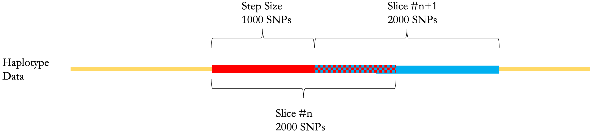
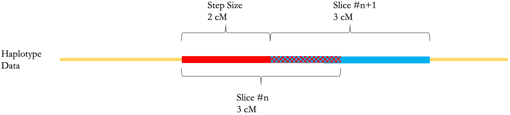

[ilash_analyzer]: https://github.com/roohy/ilash_analyzer
# iLASH: Ultra-Rapid Detection of IBD Tracts

A technical description of this work appears at: 

Ruhollah Shemirani, Gillian M. Belbin, Christy L. Avery, Eimear E. Kenny, Christopher R. Gignoux & José Luis Ambite. Rapid detection of identity-by-descent tracts for mega-scale datasets. _Nature Communications_ 12, 3546 (2021). 

https://doi.org/10.1038/s41467-021-22910-w


## Compilation and System Requirements

To compile iLASH, CMAKE v3.5 or higher is required. You will need the Boost libraries headers on your system, as 
boost::tokenizer is used for reading input. Your distribution's normal boost distribution should work, some examples are below:

Installing boost with homebrew: `brew install boost`

Installing boost from aptitude: `sudo apt install libboost-dev`

Or Boost can be installed [from source](https://www.boost.org/doc/libs/1_79_0/more/getting_started/index.html)

Then, create a directory to generate the Makefile:

`$ mkdir build`

`$ cd build`

 C++ compiler used by CMAKE should support C++ 14 standard (GCC 5 or later versions). POSIX threads library is recommended for multi-threading features.

iLASH has been tested and successfully compiled using the following compilers:

`Apple LLVM version 10.0.1 (clang-1001.0.46.4)- On macOS (Catalina & Mojave) - MacBook Pro, Mid 2015, 2.5 GHz Quad-Core Intel Core i7 with 16 GB DDR3 Memory`

`Apple Clang 13.1.6 - MacOS 12.4 on MacBook Air (M1, 2020)`

`GCC 9.4.0 on Ubuntu 20.04`

Generate the Makefile using the following command.

`$ cmake ..`

Compile iLASH using the generated Makefile:

`$ make`

The compiled output named 'ilash' can be accessed from the *build* folder now.


## Running iLASH

iLASH requires a configuration file as input.

`$ ilash configuration_file_address`

A sample configuration file is available in the repository. 
`$/build/ilash sample_config`

The command above will use the sample configuration file to do a test run of iLASH. A sample result of this command can be found in `test_files/sample_output`. Please note that iLASH is a randomized algorithm. Thus, the estimated segments will not neccesarily be an exact match for the same input file in different runs. A way to address this issue is to pass a seed number to iLASH.

In the test run, we will see the following output on the console while iLASH is getting ready to load the genotypes.

```
*** iLASH (Identity by descent using LocAlity Sensitive Hashing) ***
Configuration file address: sample_config
Automatic slicing mode is activated.
Map file address: ./test_files/test.map
Loaded 116415 lines of SNP data.
Slice detected: 0-713; Dist: 2.81803
Slice detected: 487-996; Dist: 2.81136
Slice detected: 842-1277; Dist: 2.80326
.
.
.
Slice detected: 114301-114842; Dist: 2.80182
Slice detected: 114636-115716; Dist: 2.80243
Slice detected: 115153-116346; Dist: 2.80005
Number of slices:152
Done with slicing.
The seed used for pseudo-random number generation is:1578362251613712
Approximating for 0.7 for interest and 0.99 for Match
1/5: 0.66874
2/5: 0.795271
3/5: 0.880112
4/5: 0.945742
5/5: 1
Interest T:2
 Match T:5
 ```

This log should include:

* The address for configuration file.
* Whether slicing is done through number of SNPs or genetic distance(Automatic slicing).
* Address of the PLINK map file.
* Expected number of variants based on the map file.
* A list of all the slices, with respective start and end points, and their length.
* The seed value for random number generation. This can be used for replacating purposes as iLASH is a randomized algorithm.
* Expected similarity based on the number of matching LSH hash values.

iLASH then starts to read the genotype file and estimate IBD using as many threads as allocated.

 ```
 Genotype file:./test_files/test.ped.
Threads started
Read everything from the file.
```

When all the lines of the ped file are analyzed, iLASH starts the parallel writing process.

```
Waiting for threads for finish their jobs
Writing
---168
Starting Writer Threads...
All Threads Working
Everything done in the writer part
```

The output IBD file then can be inspected for IBD tracts estimated by iLASH:

```
0	00008_0	0	00039_1	1	235345397	236767330	rs10925318	rs2820211	2.96561	1
0	00001_0	0	00039_1	1	156772899	162783473	rs10908679	rs6662567	8.76549	1
0	00000_0	0	00039_1	1	166535962	173440147	rs2075976	rs12145086	6.00494	1
0	00025_1	0	00038_1	1	1837391	4012956	rs28710181	rs4266850	5.96749	1
```
The columns are as follows:
1. Family ID for sample 1.
2. Sample ID for sample 1. Two haplotypes are differentiated using _0/_1.
3. Family ID for sample 2.
4. Sample ID for sample 2.
5. Chromosome number.
5. First basepair in the segment.
6. Last basepair in the segment.
7. First SNP ID in the segment.
8. Last SNP ID in the segment.
9. The length of the segment in cM.
10. Percentage of k-mers(token, shingles) shared between the two samples on the matched haplotypes.

The first line, for example, suggests that the first haplotype of the sample number 8 and the second haplotype of the sample number 39 share an IBD segment starting from basepair number 235345397 and ending in basepair number 236767330. The length of this segment is 2.97 cM. furthermore, the two samples share the same values for every k-mer in the region. 

Compiling iLASH and running it on the provided test data using sample configuration takes about 5 seconds on a mid-2015 Macbook Pro with a 2.5 GHz quad-core Intel Core i7 Processor.


## Configuration File

iLASH is highly customizable. Some parameters of the configuration file require knowledge about the inner workings of iLASH, and some do not.
A detailed description of iLASH and its underlying algorithms can be found at. Here we will go through all parameters. The ones that are more advanced and require reading the paper will be labeled with a star.

### Input/Output

- **ped:** Address to the phased PLINK PED formatted input.
- **map:** Address to the map file corresponding to the PED file. [PLINK PED/MAP format reference.](https://www.cog-genomics.org/plink/1.9/formats#ped)
- **output:** Output address. IBD tracts will be written to this file with the following format:

`FAMILY_ID1 SAMPLE_ID1 FAMILY_ID2 SAMPLE_ID2 CHROMOSOME_NUMBER START_BASEPAIR END_BASEPAIR START_SNPID END_SNPID LENGTH(in cM) ESTIMATED_SIMILARITY`

If you are using SHAPEIT or EAGLE or any other phasing software that generate 'hap' file format, we have made available a simple script that we use to convert them to PLINK PED files [here][ilash_analyzer].

### Segments and Slices

iLASH divides the genotype data in consecutive slices and then runs LSH algorithm over each slice. Slices (windows) are, thus, the building blocks of IBD tracts. The following parameters control different properties of these slices.


- **auto_slice:** This parameter controls the slicing approach. There are currently two approaches implemented. SNP-based and distance-based. Setting this parameter to 0 orders iLASH to use a SNP-based approach; Taking every *n* SNPs as a slice. Setting auto-slice to 1 would trigger distance-based slicing. This approach uses genetic distances in the MAP file to decide the boundaries of each slice. Each slice will be as long as the minimum length parameter. Recommended value for this parameters is 1 (default: 1).
- **slice_size:** If *auto_slice* mode is set to *0*, This parameter would be used as slice length for SNP-based slicing. For example if this parameter is set to 2000, each slice will be 2000 SNPs long. This parameter will be ignored in other slice modes (default: 800).
- **step_size:** In the SNP-based slicing approach, step size dictates how many SNPs two consecutive windows will *not* share. Figure below demonstrates a scenario with a slice size of 2000 SNPs and a step size of 1000 SNPs. This parameter is also ignored in other slicing modes (default: 800).

- **min_length:** Minimum length of IBD tracts iLASH is looking for. Segments that are shorter than this threshold will be ignored (default: 3.0).
- **slice_length:**: If *auto_slice* mode is set to 1, this value will be used in conjunction with the map file to determine the size of each slice in terms of number SNPs. This each slice will have a different SNP count but covers the same genetic distance. See the figure below (default: 3.0).
- **cm_overlap:** If *auto_slice* mode is set to 1, this value sets the amount of overlap two consecutive windows share (in terms of genetic distance). It can be thought of as the inverse of *step_size* parameter for distance-based slicing. For example, if *min_length* is set to 3 cM and *cm_overlap* is set to 1 cM, as shown in the figure below, *min_length - cm_overlap (3-1=2)* will be used to determine the starting point for the next slice (default: 1.5).


### LSH-Related Parameters

As mentioned before, iLASH performs a realization of LSH algorithm (Inspired from [Mining of Massive Datasets, Chapter 3](http://www.mmds.org)) on each slice along the genome to find, for each individual haplotype, other haplotypes that are similar to it on the same slice (window) along the chromosome. The criteria used for measuring similarity is [Jaccard Index](https://en.wikipedia.org/wiki/Jaccard_index) among pairs of haplotypes. For every haplotype at a slice, contiguous markers are grouped together to make shingles(tokens, k-mers, or words). This will turn every slice of every haplotype to a set of words and enable Jaccard Index comparisons. To learn more about LSH, Minhashing and other details regarding this step, both the paper and [Mining of Massive Datasets, Chapter 3](http://www.mmds.org) are useful to read. Here we will only explain the parameters that help control the various properties of the algorithms and will not go into the details of the algorithm itself.

- **shingle_size\*:** This parameter controls the size of every shingle (k-mer, token or word) in terms of number of SNPs in each one. Larger shingles, will contribute to less accuracy (but higher speed) and shorter shingle can lead to more false-positives and/or slower performance of iLASH. We recommend choosing a shingle size of 15-30 (default: 20). 
- **shingle_overlap:** Two neighboring shingles can overlap. This parameters controls that. We recommend an overlap of zero between shingles as it can lead to false-positives (default: 0).
- **perm_count\*:** Number of permutations done for the *Minhashing* step of LSH. Increasing the number of permutations will cause iLASH to run slower. However, The more permutations done in minhashing, the more accurate the results. We recommend 20 permutations for a subtle accuracy and 12 permutations for a speedy performance (default: 20).
- **bucket_count\*:** Number of buckets (LSH values) for generating LSH signatures. *perm_count* value should be divisible by *bucket_count* value. We recommend having a bucket count of 4 with 20 permutations and a bucket count of 3 with 12 permutations (default: 5).
- **interest_threshold:** Minimum estimated similarity score between two slices in order for them to be declared a possible match pair. Possible matche pairs are further investigated in detail to find if they contain IBD segments (default: 0.7).
- **match_threshold:** Minimum estimated similarity score between two slices in order for them to be declared a matched pair. Matched pairs are considered to be an exact match without any detailed analysis. This can increase the speed of the algorithm in exchange for possible (although unlikely) false-positives (default: 0.99).
- **minhash_threshold:** When *auto_slice* is set to 1 (or anything other than 0), This parameter sets the minimum possible length for a slice in terms of SNPs. If a slice has a smaller SNP count, they will not be analyzed in LSH steps. This is to prevent false-positives in areas of low-complexity on the genome, and any other places with SNP density of the array so low that the small number of total possible slice values. These areas will still be explored to extend IBD segments if their neighboring slices are declared a possible IBD match between two samples (default: 55).
- **seed:** The seed used for generating the random numbers for the LSH algorithm. Passing the same seed number for the same genotype data results in a replication of experiment (default: time in milliseconds from the `chrono` library).

### Other Parameters

- **max_thread:** This parameter sets the maximum number of threads to be requested by iLASH. We recommend setting it to zero on non-cluster machines so that iLASH could request for the optimal number itself (default: twice the total number of available cores).
- **max_error:** This is item is not fully implemented yet.
